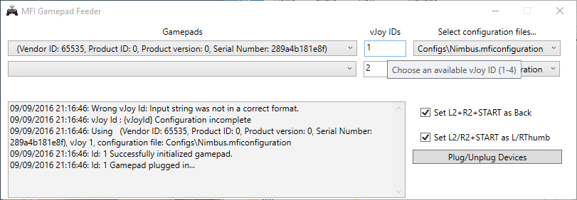

# MFI Gamepad Feeder

Have you ever wanted to use your MFI (Made for iPhone/iPad) game controller under Windows? With *MFI Gamepad Feeder* it's possible!

## How it works?

*MFI Gamepad Feeder* is a special program that needs to be used in tandem with [vJoy](http://vjoystick.sourceforge.net "vJoy") that creates virtual joystick/gamepad device in your system.

After installing *vJoy* you will recieve dummy joystick device that won't do actually anything fancy. In order to control it, you'll have to use special kind of programs, called *feeders*, in our case *MFI Gamepad Feeder*.

It looks like modern MFI game controllers are recognized as standrad HID gamepads under Windows, but they're not visible in "USB Game Controllers", so games won't be able to use them. *MFI Gamepad Feeder* is connecing to these "HID gamepads", and it's redirecting raw input from them, directly to the vJoy devices.

On this page I will guide you how to install and configure *vJoy*, and how to pair it with *MFI Gamepad Feeder*  

## Requirements

Current version of *MFI Gamepad Feeder* requires

* installed vJoy driver (v2.1.6)
* supported MFI Gamepad (see list of supported gamepads is listed below)

Application was tested on WIndows 10, but it should work on older systems as well.

## Installation

1. Download and install [vJoy 2.1.6 ](http://vjoystick.sourceforge.net "vJoy") 
2. Download and install [MFI Gamepad Feeder](https://github.com/Axadiw/MFIGamepadFeeder/releases/latest "MFI Gamepad Feeder")
3. Launch *Configure vJoy* application and select: 
	1. Axis X,Y,Rx,Ry.Sliter1 and Slider2
	2. 7 Buttons
	3. 1 continous POV
	4. Disable all force feedback effects

4. Launch *MFI Gamepad Feeder* application, click it's icon in the taskbar in order to maximize it, and select:
	1. Your gamepad from "Gamepad device" list. In my case (Steelseries Nimbus gamepad), gamepad wasn't advertising itself with correct Product name / Manufacturer Name, so I've had to guess which one it was
	2. ID of your vJoy ("1" in most cases)
	3. Correct configuration file (All configuration files are stored in the "Configs" folder in the application folder
	4. Hit Refresh

5. Play your favorite games!

I've successfulyl tested this app with [TocaEdit Xbox 360 Controller Emulator](http://www.x360ce.com/default.aspx "TocaEdit Xbox 360 Controller Emulator"), so you can use your MFI gamepads as Xbox 360 controller!

# Application development

I've started with support for Steelseries Nimbus controller only, if you'd like to add support for other game controller, post proper request on GitHub Issues apge.

## Supported gamepads

* SteelSeries Nimbus

#### Not compatibile:

* Mad Catz Micro C.T.R.L i

# Special thanks

Special thanks goes to:

* vJoy [http://vjoystick.sourceforge.net](http://vjoystick.sourceforge.net)
* HidSharp [http://www.zer7.com/software/hidsharp](http://www.zer7.com/software/hidsharp)

# Icon

Program icon made by Freepik (www.flaticon.com), licensed by CC BY 3.0

# License

The MIT License (MIT)

Copyright (c) 2015 Michał Mizera

Permission is hereby granted, free of charge, to any person obtaining a copy of this software and associated documentation files (the "Software"), to deal in the Software without restriction, including without limitation the rights to use, copy, modify, merge, publish, distribute, sublicense, and/or sell copies of the Software, and to permit persons to whom the Software is furnished to do so, subject to the following conditions:

The above copyright notice and this permission notice shall be included in all copies or substantial portions of the Software.

THE SOFTWARE IS PROVIDED "AS IS", WITHOUT WARRANTY OF ANY KIND, EXPRESS OR IMPLIED, INCLUDING BUT NOT LIMITED TO THE WARRANTIES OF MERCHANTABILITY, FITNESS FOR A PARTICULAR PURPOSE AND NONINFRINGEMENT. IN NO EVENT SHALL THE AUTHORS OR COPYRIGHT HOLDERS BE LIABLE FOR ANY CLAIM, DAMAGES OR OTHER LIABILITY, WHETHER IN AN ACTION OF CONTRACT, TORT OR OTHERWISE, ARISING FROM, OUT OF OR IN CONNECTION WITH THE SOFTWARE OR THE USE OR OTHER DEALINGS IN THE SOFTWARE.
